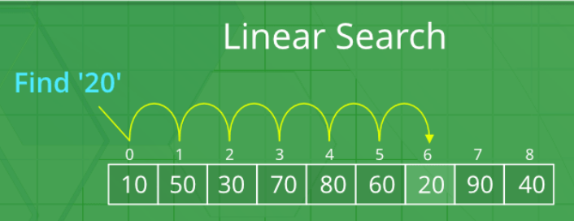

## Linear Search

Linear Search is a sequential search algorithm that starts at one end and goes through each element of a list until the desired element is found, otherwise the search continues till the end of the data set.

[image collected from gfg]

### **Complexity Analysis of Linear Search:**

**Time Complexity:**

<ul>
    <li><b>Best Case:</b> O(1)</li>
    <li><b>Worst Case:</b> O(N)</li>
    <li><b>Average Case:</b> O(N)</li>
</ul>

**Space Complexity:**

<ul>
    <li><b>Auxiliary Space:</b> O(1)</li>
</ul>

**Advantages of Linear Search:**

<ul>
    <li>Can be used irrespective of whether the array is sorted or not</li>
    <li>Can be used on arrays of any data type</li>
    <li>Does not require additional memory</li>
</ul>

**Drawbacks of Linear Search:**

<ul>
    <li>Time complexity of O(N)</li>
    <li>Not suitable for large array</li>
    <li>Does not require additional memory</li>
</ul>

**When to use Linear Search:**

<ul>
    <li>While working small dataset</li>
    <li>Need to search for a dataset in contiguous memory</li>
</ul>
