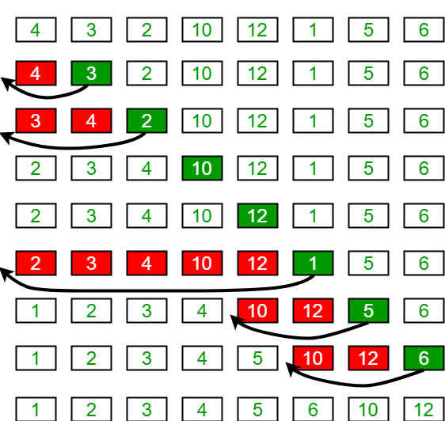

## Insertion Sort

Insertion sort works similar to the way we sort playing cards in out hands. The array is virtually split into a sorted and an unsorted part. Values from the unsorted part are picked and placed at the correct position in the sorted part.

**<u>Insertion Sort Process</u>**

Time Complexity: O(N^2)  
Auxiliary Space: O(1)

**<u>Complexity Analysis of Insertion Sort : </u>**

- Time Complexity of Insertion Sort
  - worst-case : O(N^2)
  - average case : O(N^2)
  - best case : O(N)
- Space Complexity of Insertion Sort
  - auxiliary space complexity : O(1)
