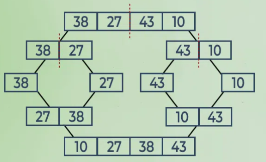

## Merge Sort  

Merge sort is defined as a sorting algorithm that works by dividing an array into smaller subarrays, sorting each subarray, and then merging the sorted subarrays back together to form the final sorted array. 
 
  
**<u>Merge Sort Process</u>**

  

**<u>Time Complexity:</u> O(N log(N))**  

Merge Sort is a recursive algorithm and time complexity can be expressed as following recurrence relation : T(n) = 2T(n/2) + θ(n)

**<u>Auxiliary Space:</u> O(N)**  

**Applications of Merge Sort:**  
<ul>
    <li><b>Sorting large datasets:</b> Well-suited for sorting large datasets due to its guaranteed worst-case time complexity of O(n log n).</li>
    <li><b>External sorting:</b> Where the data to be sorted is too large to fit into memory.</li>
    <li><b>Custom Soring:</b> It can be used to handle differne input distributions such as partially sorted, nearly sorted, or completely unsorted data.</li>
</ul>

**Advantages of Merge Sort:**  
<ul>
    <li><b>Stability:</b> Stable.</li>
    <li><b>Guaranted worst-case time complexity:</b> Has a worst-case time complexity of O(N logN).</li>
    <li><b>Parallelizable:</b> Take advantage of multiple processors or threads.</li>
</ul>  

**Drawbacks of Merge Sort:**  
<ul>
    <li><b>Space Complexity:</b> requires additional memory to store the sub-arrays. </li>
    <li><b>Not in place:</b> requires additional memory.</li>
    <li><b>Not always optimal for small dataset</b></li>
</ul>